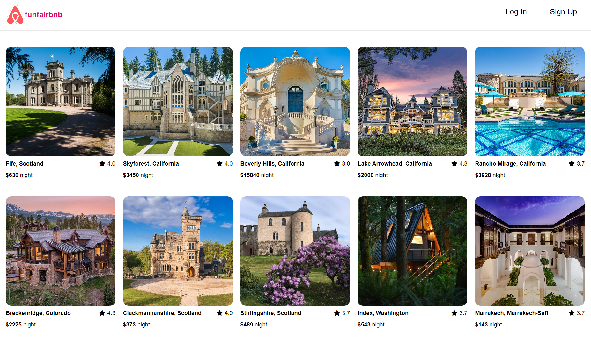
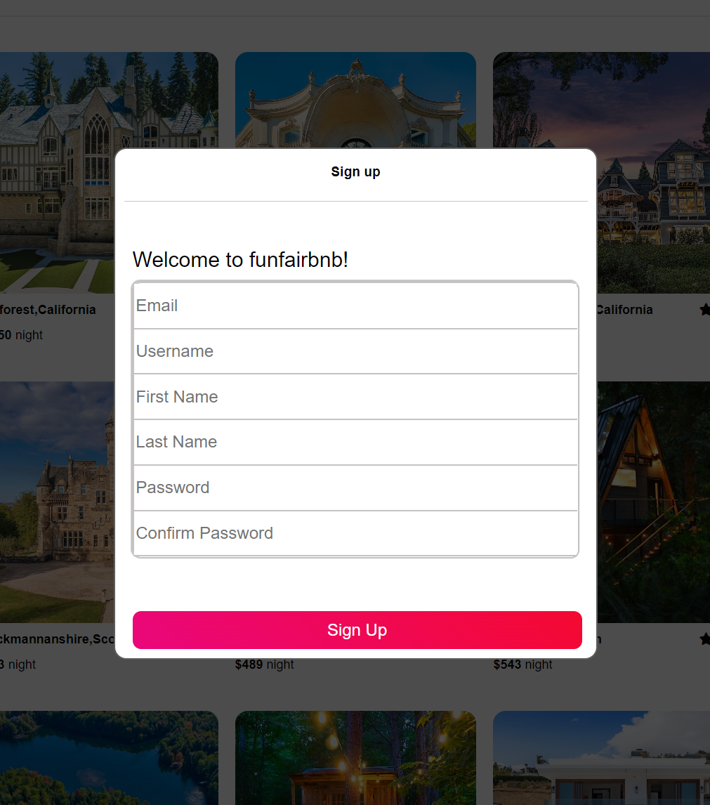
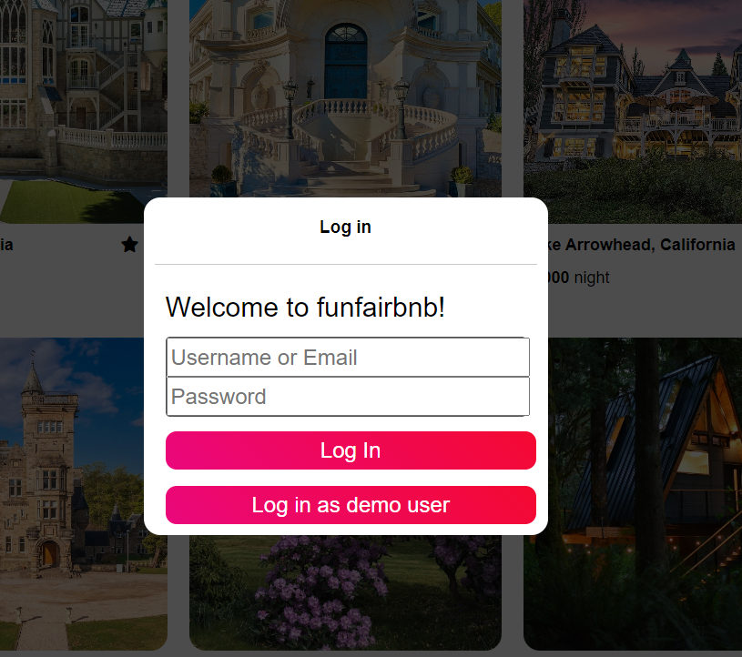
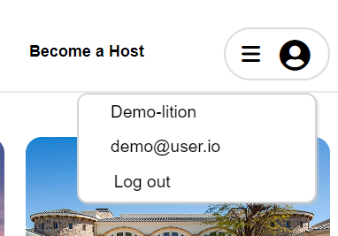
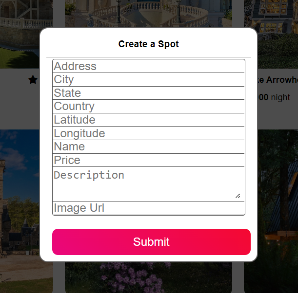
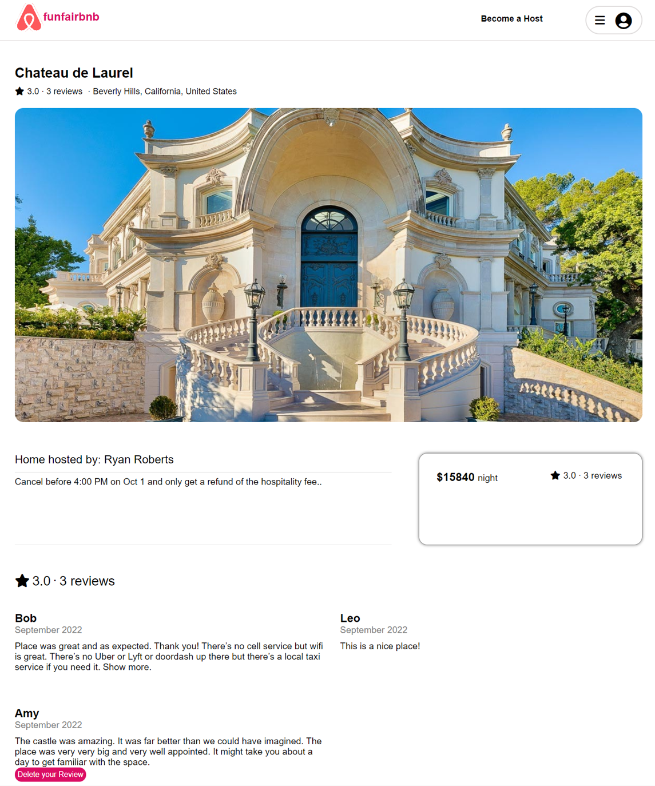
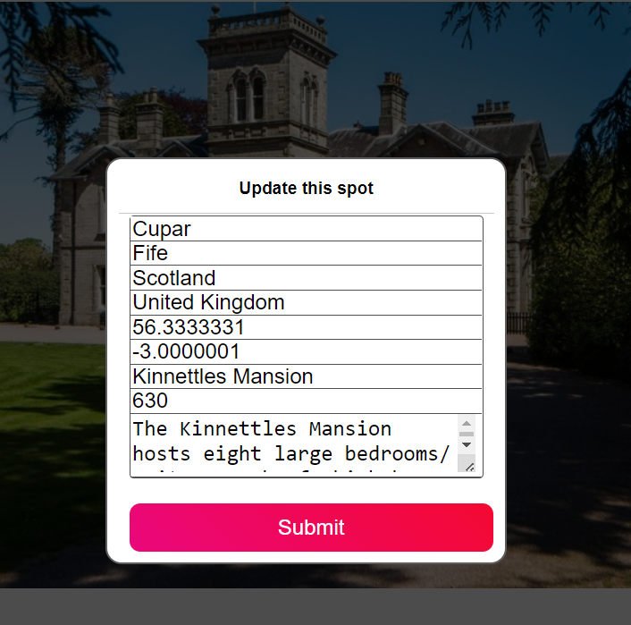
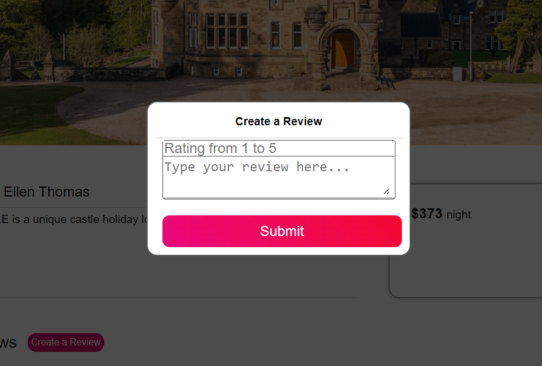
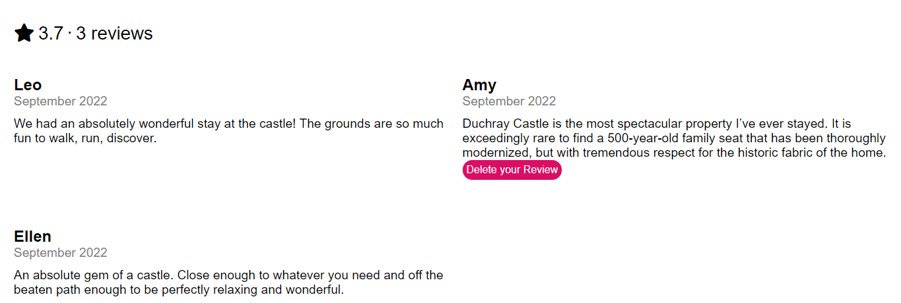

# About FunFairBnB

FunFairBnB is a web application inspired by [AirBnB](https://www.airbnb.com/). It is an online marketplace that connects people who want to rent out their properties with those who search for locations to live while traveling. 

**[Click here to view FunFairBnB Live Site](https://fiona-airbnb.herokuapp.com/)**

## Please see below links to project Wiki

 - [API Documentation](https://github.com/nachen98/AirBnB-clone/wiki/API-Documentation)
 - [Database Schema](https://github.com/nachen98/AirBnB-clone/wiki/Database-Schema)
 - [Features](https://github.com/nachen98/AirBnB-clone/wiki/Features-List)
 - [Redux Store Shape](https://github.com/nachen98/AirBnB-clone/wiki/Redux-Store-Shape)
 
## Tech Stack

#### Frameworks, Platforms, & Libraries:

#### Database:

## Features Directions:

### Splashing Page

Splended houses are displayed to everyone in a grid view. Clicking each spot will direct user to the spot detailed page.

### Sign-up Form

Want to be a host? You can sign up easily by filling out this modern sign-up form modal.

### Log-in Form

Users are able to log-in to utilize more functions: becoming a host, creating a review... People can also log in as a demo user to browse the website.

### Dropdown Menu

The dropdown menu displays current user's info and the log-out tab.

### Create a Spot Form

Filling out this creating spot form helps you attract travelers all around the world!

### Spot Details Page

Detailed info including the address, pictures, description, price, reviews, star ratings are rendered on this page neatly.

### Update Spot Form

Spot info can be conveniently updated by owners via this form.

### Create/Delete a Review

Users can freely create and delete their own review on a spot.

## To-Do List:

 - Add more spot images to a spot.
 - Add booking feature for users to reserve a spot.
 - Allow users to browse their own reviews and spots.

## Get Started:

* Clone the project folder.
* cd into the backend folder and npm install the packages and its dependencies.
* Run the backend server by using the command 'npm start'.
* Open another terminal, cd into the frontend folder and npm install the packages and its dependencies.
* Start running the frontend server by using 'npm start'.
* The site is able to be viewed at http://localhost:3000/

## Contact Information:

www.linkedin.com/in/na-chen-pharmd2019
https://github.com/nachen98